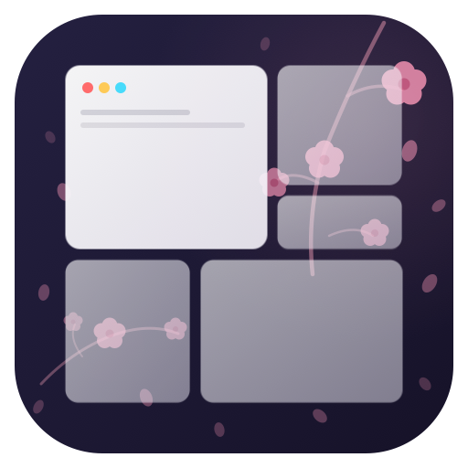

<p align="center">
  
</p>

# Shitsurae

[日本語版はこちら (README.ja.md)](README.ja.md)

**Shitsurae** is a macOS workspace arranger that brings order to your desktop with a single command.

The name comes from the Japanese word *室礼（しつらえ）* — the traditional art of arranging a room with intention and harmony. Just as a physical space is carefully set for its purpose, Shitsurae lets you define and instantly reproduce your ideal digital workspace.

## What It Solves

- Rebuilding your window layout manually every morning
- Losing window positions when displays are connected or disconnected
- Slow context-switching with `Cmd+Tab` across many windows
- Repeating the same layout work for different tasks (coding, review, meetings, etc.)

Define your ideal setup in YAML, then apply it with one command:

```bash
shitsurae arrange work
```

## Key Features

### 1. One-command layout apply (`arrange`)

Define layouts in YAML, and `shitsurae arrange <name>` will:

- Launch apps that aren't running yet (`launch: true`)
- Move windows to the designated Spaces
- Position and resize each window to the specified frame
- Set initial focus after arrangement

Position and size accept flexible units: `%` (screen ratio), `pt` (logical points), `px` (physical pixels), `r` (0.0–1.0 ratio).

### 2. Keyboard-first workflow

Every operation is available from the keyboard. Default shortcuts:

| Action | Default | Description |
|--------|---------|-------------|
| Slot focus | `Cmd+1` – `Cmd+9` | Jump directly to a numbered window |
| Next window | `Cmd+Ctrl+J` | Cycle forward within the current Space |
| Previous window | `Cmd+Ctrl+K` | Cycle backward within the current Space |
| Switcher | `Cmd+Tab` | Open the window switcher overlay |
| Snap presets | Configurable | Left half, right half, thirds, maximize, center, etc. |

All shortcuts are fully configurable in YAML. You can also disable specific shortcuts per app to avoid conflicts (e.g., `Cmd+1` in Discord).

### 3. Built-in window switcher

A custom switcher triggered by `Cmd+Tab` (configurable):

- Prioritizes windows on the current Space
- Each candidate gets a quick key (`a`, `s`, `d`, `f`, …) for one-keystroke selection
- Supports `acceptOnModifierRelease` — just release the modifier to confirm
- Configurable accept/cancel keys, quick key string, and Space scope

### 4. Window snap actions

Built-in snap presets for quick window positioning:

- `leftHalf`, `rightHalf`, `topHalf`, `bottomHalf`
- `leftThird`, `centerThird`, `rightThird`
- `maximize`, `center`

Bind any of these to a global shortcut in your YAML config.

### 5. Menu bar + GUI app

Shitsurae runs as a standard macOS app with both a menu bar presence and a main window.

**Menu bar** — always-available controls:
- Apply any defined layout
- Open main window
- Preferences and diagnostics
- Open config directory
- Reload config

**Main window** — full GUI with sidebar navigation:
- Visual layout preview with color-coded slots
- Arrangement controls with dry-run option
- Shortcut reference
- Permission status and diagnostics

### 6. CLI + automation

The CLI exposes the same functionality for shell scripts and automation:

```bash
shitsurae arrange <layout> --dry-run --json    # Preview the execution plan
shitsurae arrange <layout> --json              # Apply a layout
shitsurae arrange <layout> --space 2 --json    # Apply to a specific Space
shitsurae layouts list                         # List defined layouts
shitsurae validate --json                      # Validate config files
shitsurae diagnostics --json                   # Show system diagnostics
shitsurae window current --json                # Current window info
shitsurae window set --x 0% --y 0% --w 50% --h 100%   # Move + resize
shitsurae focus --slot 1                       # Focus by slot number
shitsurae focus --bundle-id com.apple.TextEdit  # Focus by app
shitsurae switcher list --json                 # List switcher candidates
```

`window move`, `window resize`, and `window set` default to the focused window when you omit a selector. Selectors: `--window-id` (exact window), `--bundle-id` (app), `--title` (combined with `--bundle-id`).

### 7. Multi-display support

- Match displays by role (`primary` / `secondary`) or resolution conditions
- Define multiple resolution-specific layouts for the same Space — the first match is applied
- Seamless switching between MacBook-only and external-monitor setups without config changes

### 8. Config auto-reload

- Reads all `*.yml` / `*.yaml` files in the config directory (sorted by filename)
- Watches for file changes and auto-reloads
- On syntax errors, keeps the last valid config and shows errors in diagnostics

## Requirements

- macOS 15 (Sequoia) or later
- Accessibility permission (required)
- Screen Recording permission (optional — only for thumbnail overlays in the switcher)

No network communication is required for normal operation.

## Installation

### Build from source

```bash
swift build
```

Run tests:

```bash
swift test
```

Build the app bundle:

```bash
make app
```

Output:

- `dist/Shitsurae.app`
- Bundled CLI: `dist/Shitsurae.app/Contents/Resources/shitsurae`

### First launch (non-notarized builds)

If you distribute the `.app` directly, remove quarantine before first launch:

```bash
xattr -dr com.apple.quarantine Shitsurae.app
open Shitsurae.app
```

## Configuration

### Config directory

Resolved in order:

1. `$XDG_CONFIG_HOME/shitsurae/`
2. `~/.config/shitsurae/`

All `*.yml` / `*.yaml` files are loaded in filename order. Split configs by purpose (`work.yml`, `home.yml`, etc.) as you see fit.

### YAML schema / LSP

Enable YAML LSP validation and completion by adding this comment to your config file:

```yaml
# yaml-language-server: $schema=https://raw.githubusercontent.com/yuki-yano/shitsurae/refs/heads/main/schemas/shitsurae-config.schema.json
```

### Basic example

```yaml
layouts:
  work:
    initialFocus:
      slot: 1
    spaces:
      - spaceID: 1
        windows:
          - slot: 1
            launch: false
            match:
              bundleID: com.apple.TextEdit
            frame:
              x: "0%"
              y: "0%"
              width: "50%"
              height: "100%"
          - slot: 2
            launch: false
            match:
              bundleID: com.apple.Terminal
            frame:
              x: "50%"
              y: "0%"
              width: "50%"
              height: "100%"
```

More samples in `samples/`.

### Window matching

Windows are matched using `match`:

- `bundleID` (required) — app bundle identifier
- `title` — match by `equals`, `contains`, or `regex`
- `profile` — Chromium browser profile directory name
- `role` / `subrole` — accessibility role
- `index` — window index within the app (1-based)
- `excludeTitleRegex` — exclude windows whose title matches

### Chromium browser profiles

For Chrome, Brave, Edge, and Chromium, use `match.profile` to target a specific browser profile:

```yaml
- slot: 1
  launch: true
  match:
    bundleID: com.google.Chrome
    profile: Default
  frame:
    x: "0%"
    y: "0%"
    width: "50%"
    height: "100%"
```

- `profile` is the directory name (`Default`, `Profile 1`, etc.), not the display name.
- With `launch: true`, Shitsurae starts the browser with `--profile-directory=<profile> --new-window`.
- `shitsurae window current --json` includes a `profile` field when resolvable.

### Space move method

Control how Shitsurae moves windows between Spaces:

```yaml
executionPolicy:
  spaceMoveMethod: drag
  spaceMoveMethodInApps:
    org.alacritty: displayRelay
```

- `drag` — drags the window while sending the macOS desktop-switch shortcut
- `displayRelay` — in multi-monitor `perDisplay` setups, temporarily relocates the window to another display, switches Space, then moves it back

### Ignore rules

Exclude apps or windows from arrangement and focus operations:

```yaml
ignore:
  apply:
    apps:
      - com.apple.finder
    windows:
      - bundleID: com.google.Chrome
        titleRegex: "^DevTools"
  focus:
    apps:
      - com.apple.SystemPreferences
```

### Shortcut customization

```yaml
shortcuts:
  # Per-app enable/disable for Cmd+1..9 only
  focusBySlotEnabledInApps:
    com.hnc.Discord: false
    com.tinyspeck.slackmacgap: false

  # Exclude from Cmd+Ctrl+J / K cycling
  cycleExcludedApps:
    - com.hnc.Discord

  # Exclude from Cmd+Tab switcher
  switcherExcludedApps:
    - com.tinyspeck.slackmacgap

  # Snap preset shortcuts
  globalActions:
    - key: H
      modifiers: [cmd, ctrl]
      action:
        type: snap
        preset: leftHalf
    - key: L
      modifiers: [cmd, ctrl]
      action:
        type: snap
        preset: rightHalf
```

## License

MIT
