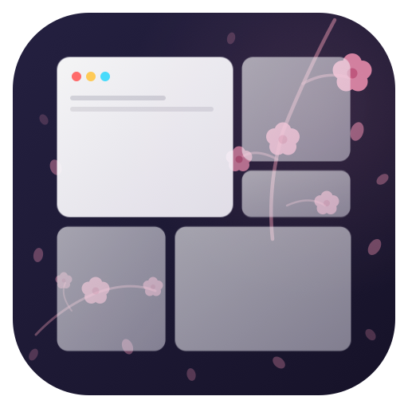

<p align="center">
  
</p>

# Shitsurae

[日本語](README.ja.md)

**Shitsurae** is a macOS window manager that lets you define task-specific window arrangements in YAML and recall them from the keyboard, GUI, or CLI.

It provides its own virtual workspaces, so you can switch between coding, research, communication, and other working contexts without creating more Mission Control desktops.

Its name comes from *shitsurai* (室礼), the Japanese practice of arranging a space for its purpose.

<p align="center">
  
</p>

## What you can do

- Launch apps, place their windows, and set the initial focus in one action
- Switch virtual workspaces with `Ctrl+1` through `Ctrl+9`
- Focus a specific window with `Cmd+1` through `Cmd+9`
- Use `Cmd+Tab` to switch between individual windows
- Send the current window to another virtual workspace
- Bind window snapping actions such as left half, right half, and maximize
- Manage independent layouts and virtual workspaces on each display
- Operate the same layouts from the GUI or CLI

## Requirements

- macOS 15 Sequoia or later
- Accessibility permission (required)
- Screen Recording permission (only for switcher thumbnails)

Normal operation does not require external network access.

## Installation

Install Shitsurae with Homebrew Cask.

```bash
brew tap yuki-yano/shitsurae
brew install --cask shitsurae
xattr -dr com.apple.quarantine /Applications/Shitsurae.app
open /Applications/Shitsurae.app
```

This installs `Shitsurae.app` in `/Applications` and makes the `shitsurae` CLI available on your normal `PATH`.

> [!WARNING]
> The distributed app is not notarized.
> The `xattr` command removes the macOS quarantine attribute, so run it only if you trust the distribution source.

After the first launch, open the Shitsurae **Permissions** screen and enable Accessibility access in System Settings.

Enable Screen Recording as well if you want window thumbnails in the switcher.
Without it, the switcher continues to work with app icons.

## Your first layout

### 1. Create a config file

Create `~/.config/shitsurae/work.yaml`.

```yaml
# yaml-language-server: $schema=https://raw.githubusercontent.com/yuki-yano/shitsurae/refs/heads/main/schemas/shitsurae-config.schema.json

layouts:
  work:
    initialFocus:
      slot: 1
    spaces:
      - spaceID: 1
        windows:
          - slot: 1
            launch: true
            match:
              bundleID: com.apple.TextEdit
            frame:
              x: "0%"
              y: "0%"
              width: "50%"
              height: "100%"
          - slot: 2
            launch: true
            match:
              bundleID: com.apple.Terminal
            frame:
              x: "50%"
              y: "0%"
              width: "50%"
              height: "100%"
      - spaceID: 2
        windows:
          - slot: 1
            launch: true
            match:
              bundleID: com.apple.Notes
            frame:
              x: "0%"
              y: "0%"
              width: "100%"
              height: "100%"
```

This layout places TextEdit and Terminal side by side in Space 1, with Notes filling Space 2.

### 2. Validate the config

```bash
shitsurae validate --json
```

If validation succeeds, preview the arrangement without moving any windows.

```bash
shitsurae arrange work --dry-run --json
```

### 3. Apply the layout

```bash
shitsurae arrange work
```

To use the GUI, open **Arrange**, select `work`, and press **Apply**.

Shitsurae launches the configured apps, places their windows, and shows Space 1.
You can then switch between the two virtual workspaces with `Ctrl+1` and `Ctrl+2`.

When Shitsurae quits, it returns parked windows to the screen and discards the runtime workspace state.
Apply a layout again after the next launch.

## Everyday controls

The default shortcuts are:

| Action | Shortcut |
| --- | --- |
| Focus slot 1 through 9 | `Cmd+1` through `Cmd+9` |
| Switch to Space 1 through 9 | `Ctrl+1` through `Ctrl+9` |
| Send the current window to Space 1 through 9 | `Option+1` through `Option+9` |
| Next window | `Cmd+Ctrl+J` |
| Previous window | `Cmd+Ctrl+K` |
| Window switcher | `Cmd+Tab` |

`Cmd+Tab` lists windows in most-recently-used order.
Selecting a window in another virtual workspace switches to that workspace before focusing it.

`mode.followFocus` is enabled by default.
Focusing a managed window from the Dock or with the mouse automatically switches to its virtual workspace.

## GUI

The main window is organized around the tasks you perform:

- **Arrange**: select and apply a layout or Space for each display
- **Workspace State**: inspect tracked windows and their current placement state
- **Layouts**: preview every Space loaded from YAML
- **General**: inspect application behavior such as launch at login
- **Shortcuts**: inspect the active keyboard shortcuts
- **Permissions**: check Accessibility and Screen Recording access
- **Diagnostics**: inspect config errors, displays, and runtime state

The menu bar also provides layout application, config-directory access, and quit actions.

## Configuration

### Config directory

Shitsurae resolves its config directory in this order:

1. `$XDG_CONFIG_HOME/shitsurae/`
2. `~/.config/shitsurae/`

It loads `*.yml` and `*.yaml` files directly inside that directory in filename order, so layouts and shortcuts can be split across multiple files.

Config files reload automatically.
If a reload fails, Shitsurae keeps the last valid config and shows the error in **Diagnostics**.

To launch Shitsurae when you log in, add:

```yaml
app:
  launchAtLogin: true
```

### Stored data

Shitsurae stores the following data locally:

| Data | Location |
| --- | --- |
| Config | `$XDG_CONFIG_HOME/shitsurae/` or `~/.config/shitsurae/` |
| Runtime workspace state | `$XDG_STATE_HOME/shitsurae/runtime-state.json` or `~/.local/state/shitsurae/runtime-state.json` |
| Logs | `~/Library/Logs/Shitsurae/shitsurae.log` |

The runtime state file allows Shitsurae to return parked windows safely to the screen.
Do not delete it while Shitsurae may still have managed windows parked offscreen.

### Matching windows

Each window is identified by a `match` definition:

- **`bundleID`**: application bundle identifier (required)
- **`title`**: window title matched with `equals`, `contains`, or `regex`
- **`profile`**: Chromium profile directory name
- **`role` / `subrole`**: Accessibility roles
- **`index`**: window number within the application
- **`excludeTitleRegex`**: titles to exclude

Inspect the frontmost window with:

```bash
shitsurae window current --json
```

When the same `bundleID` appears in multiple slots, distinguish each definition with `title`, `profile`, or `index`.
An ambiguous definition is rejected as a config error.

Chromium-based browsers support per-profile launching and tracking:

```yaml
- slot: 1
  launch: true
  match:
    bundleID: com.google.Chrome
    profile: Default
  frame:
    x: "0%"
    y: "0%"
    width: "100%"
    height: "100%"
```

### Position and size

The `frame` fields accept:

- `%`: percentage of the display
- `pt`: macOS logical points
- `px`: physical pixels
- `r`: a ratio from `0.0` to `1.0`

If `frame` is omitted, Shitsurae registers the window in the virtual workspace while preserving its current position and size.

### Shortcuts

Every global shortcut can be changed in YAML.

```yaml
shortcuts:
  nextWindow:
    key: j
    modifiers: [cmd, ctrl]

  prevWindow:
    key: k
    modifiers: [cmd, ctrl]

  switcher:
    trigger:
      key: tab
      modifiers: [cmd]
    quickKeys: "1234567890qwertyuiopasdfghjkl"
    acceptKeys: [enter]
    cancelKeys: [esc]

  globalActions:
    - key: H
      modifiers: [cmd, ctrl]
      action:
        type: snap
        preset: leftHalf
    - key: L
      modifiers: [cmd, ctrl]
      action:
        type: snap
        preset: rightHalf
```

Available snap presets are `leftHalf`, `rightHalf`, `topHalf`, `bottomHalf`, `leftThird`, `centerThird`, `rightThird`, `maximize`, and `center`.

You can disable individual Shitsurae shortcuts in applications where they conflict with app-specific bindings.
See the [YAML Schema](schemas/shitsurae-config.schema.json) for every config field.

### Multiple displays

Give physical displays stable names under `monitors`, then reference those names from each layout's `display.monitor`.

```yaml
monitors:
  main:
    primary: true
  side:
    width: 2560
    height: 1440

layouts:
  work:
    display:
      monitor: main
    spaces:
      - spaceID: 1
        windows: []

  reference:
    display:
      monitor: side
    spaces:
      - spaceID: 1
        windows: []
```

Layouts assigned to different displays can be applied together:

```bash
shitsurae arrange work reference
```

When an external display disconnects, its workspace becomes dormant.
After reconnection, Shitsurae resolves the declared display again and restores the window arrangement.

> [!IMPORTANT]
> Use narrow match rules for layouts on non-primary displays, such as a dedicated `bundleID`, `title`, or `profile`.
> A broad rule such as a browser's bare `bundleID` can also match that application's windows on other displays.

## How virtual workspaces work

Shitsurae does not manipulate native macOS Spaces.

When switching workspaces, it returns the target windows to the screen and moves other managed windows just outside the display.
For applications that reject offscreen placement, Shitsurae minimizes only the affected window and restores it when you return.

Transient windows such as dialogs and sheets remain visible.
After the interaction finishes, their parent windows return to the assigned workspace.

## CLI

Common commands include:

```bash
shitsurae layouts list
shitsurae validate --json
shitsurae diagnostics --json

shitsurae arrange work --dry-run --json
shitsurae arrange work

shitsurae space list --json
shitsurae space current --json
shitsurae space switch 2 --json

shitsurae window current --json
shitsurae window workspace 2 --json
shitsurae window set -x 0% -y 0% -w 50% -h 100%

shitsurae focus --slot 1
shitsurae switcher list --json
```

The CLI connects to the Shitsurae app over a Unix domain socket.
It launches the app automatically if it is not already running.

Run `shitsurae <subcommand> --help` to see the options for each command.

## Troubleshooting

### A layout does not load

Validate the config, then check **Diagnostics** for the filename and error details.

```bash
shitsurae validate --json
```

### A window cannot be found

Check Accessibility access under **Permissions**, bring the target window to the front, and inspect its match data:

```bash
shitsurae window current --json
```

When registering multiple windows from the same application, distinguish them with `title`, `profile`, or `index`.

### A shortcut does not respond

Check the active assignment under **Shortcuts**.
If macOS or the frontmost application uses the same key, change the Shitsurae binding or disable it only for the conflicting application with `shortcuts.disabledInApps`.

### Recovery required appears

This means an operation remains whose final window visibility could not be confirmed safely.
First quit Shitsurae normally and verify that parked windows return to the screen.

Clear the state manually only after confirming that every managed window is visible and the pending recovery data is no longer needed.

```bash
shitsurae space recover --force-clear-pending --yes --json
```

After clearing it, reconcile visibility by switching to the intended Space with `--reconcile`:

```bash
shitsurae space switch 1 --reconcile --json
```

## Uninstalling

Remove the app with:

```bash
brew uninstall --cask shitsurae
```

To remove its config and logs as well, run:

```bash
brew zap shitsurae
```

## Building from source

```bash
swift build
swift test
make app
```

The app bundle is written to `dist/Shitsurae.app`.

## License

MIT
